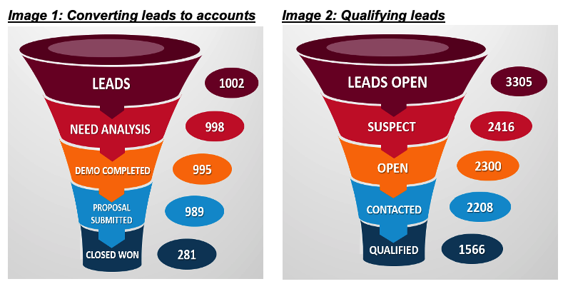

# Salesforce Data Analysis

## Project Summary

In this project, we are working with the Salesforce data of Auto/mate, to uncover the behavioral patterns of the leads through the sales funnel. As per the data, major changes are at the stage of the proposal submitted to closed won. Our project will limit our analysis on two broad areas as mentioned below:

- Conversion of leads to opportunities (Image 1)

- Conversion of opportunities into closed won/closed lost (Image 2)

We will identify the patterns and findings using appropriate algorithms in the above two categories of the sales process. More details can be found in the report file.

